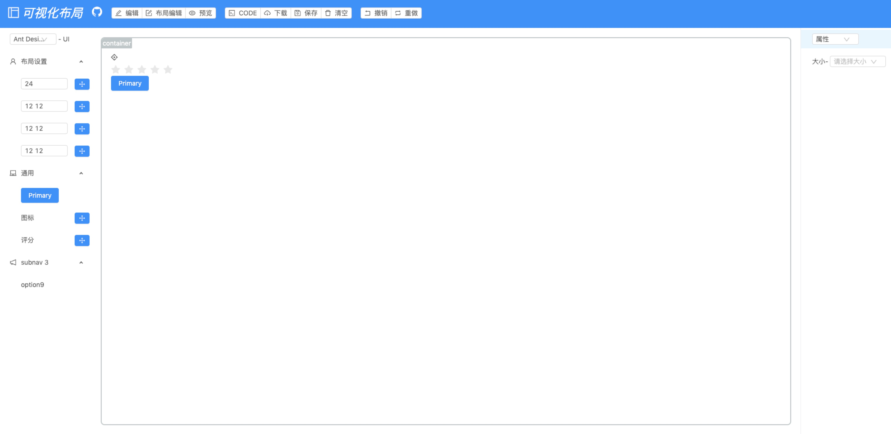
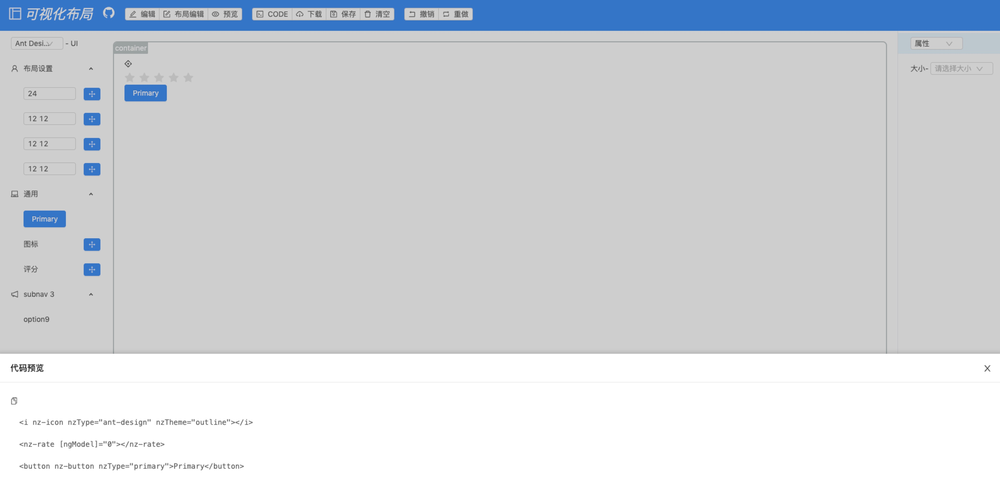

<!--                                                                                                                      
 * @Author: luohong
 * @Date: 2019-08-07 10:32:58
 * @LastEditors: luohong
 * @LastEditTime: 2019-08-26 14:57:17
 * @Description: 
 * @email: 3300536651@qq.com
 -->
# NgantdDragForm

可视化布局。列表页面、表单页面，因为这两个页面的工作量很大，公司处于前端极少，后端多的传统型企业，如何让后端人员快速的学会布局列表、表单页面呢？我基于谷歌开源的angular8、蚂蚁金服开源的ng.ant.design做了一个可视化布局的插件，可以通过拖拽进行布局、列表页面、表单页面生成，不考虑业务。只考虑静态页面
- 预览地址: https://luohong123.github.io/AngularDragLayout/demo/index.html

- 拖拽组件



- 预览代码


# 打包
```bash
ng build --prod --aot=false --build-optimizer=false --base-href //
```
